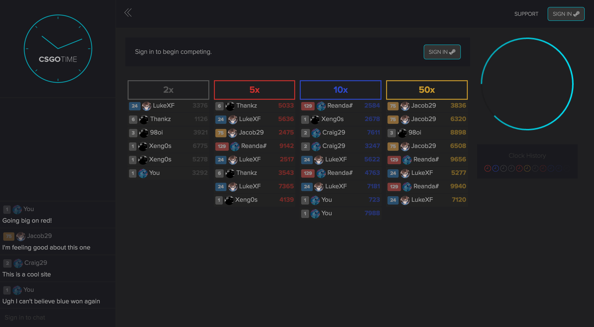
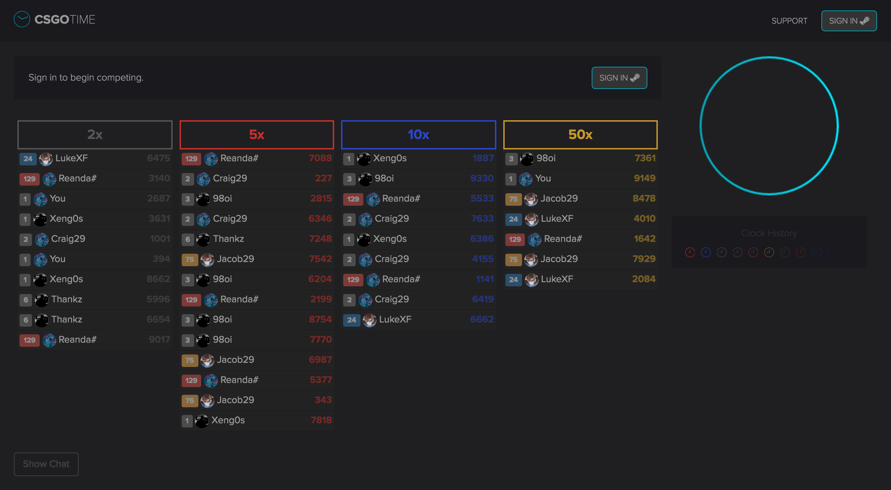
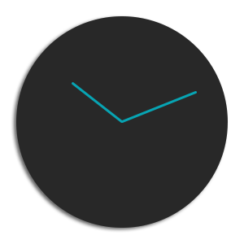

# CSGO Time
CSGO Time, deposit skins, play against the clock and win big.

**This is the design repo**

Current versions:
- **Website** - v0.3
- **Logo** - v0.8
- **Icon** - v0.2

Built using:
- **PHP** - 7.0
- **Sass** - v3.4.19
- **jQuery** - v1.12.3
- **Black Tie** - v1.0.0
- **Bootstrap** - v3.3.6
- **Circle Progress** - v1.1.6
- **HTML 5**
- **CSS 3**

Timeframes:
- **First submission to client**: Saturday 4th June 2016
- **Planned completion date**: Sunday 12th June 2016
- **Project absolute deadline**: Wednesday 15th June 2016

Revision History
====
The client has specifically asked for recorded revison history to mark progress. Below is that history.

Website
---

|v0.5 - with chat window enabled (logged in) |v0.5 - with chat window hidden (logged out) |
|---|---|
|v0.4 - with chat window enabled |v0.4 - with chat window hidden |
|v0.3 - with chat window enabled |v0.3 - with chat window hidden |

Logo and Icon
---
Please note, the logo will always be viewed on a dark background, the logos (v8 to v6) need to be viewed on a dark background

|Logo v8 |Logo v7 |Logo v6 |Logo v5 |
|---|---|---|---|
|**Logo v4** |**Logo v3** |**Logo v2** |**Logo v1** |

|Icon v2 |Icon v1 |||||||
|---|---|---|---|---|---|---|---|

